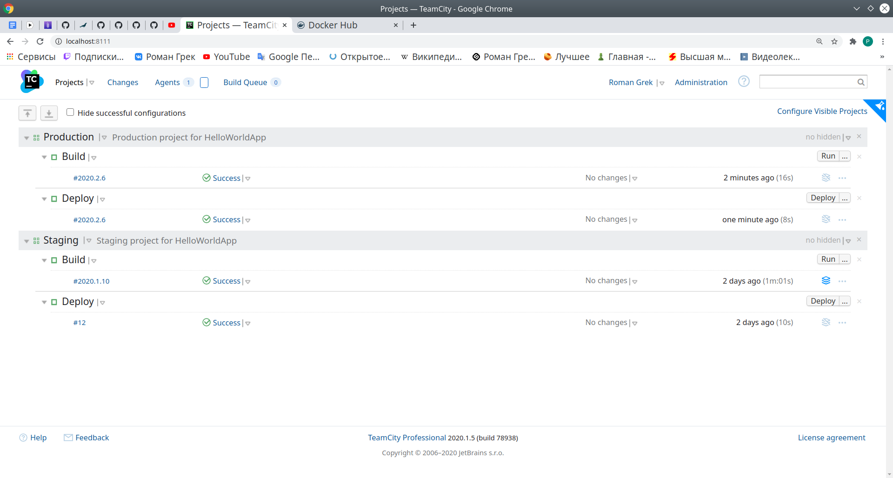

This folder contains screenshots of CI/CD configuration in TeamCity.
Source files of project are [here](https://github.com/roman-grek/HelloWorldAspNetCore).
Production image on [Dockerhub](https://hub.docker.com/repository/docker/skeptic2000/hello-world-production).

## Projects in TeamCity

## Staging project

### Build configuration

### Deploy configuration

## Production project

### Build configuration

### Deploy configuration

## Running instances

